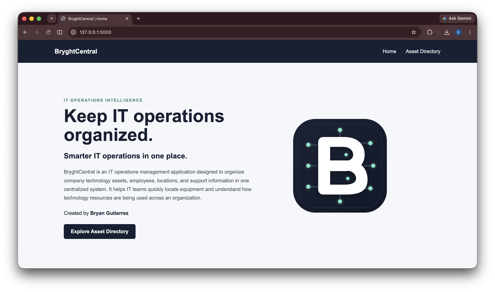
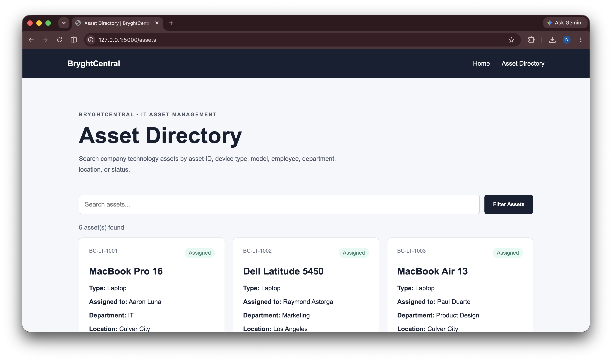
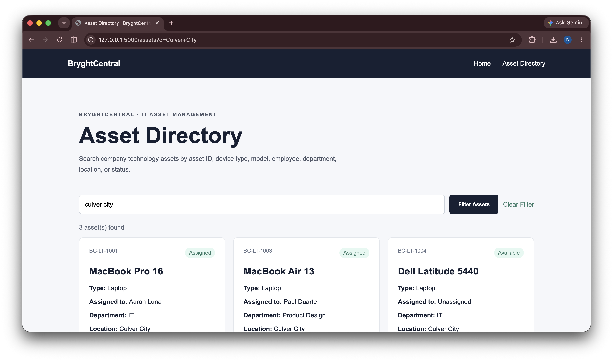

# BryghtCentral

**Student:** Bryan Gutierrez  
**Course:** IT 401 - Web Intelligence  
**Assignment:** A1 - Customize & Extend the IT401 Project Template

---

## Project Overview

BryghtCentral is an IT operations management application designed to help organizations manage technology assets and related IT information in one centralized system.

The application is intended for IT support teams and other technology staff who need a simple way to view equipment, identify who devices are assigned to, locate assets, and understand their current status.

The problem BryghtCentral addresses is that IT information can become difficult to manage when equipment, employees, locations, and access information are stored across separate systems or spreadsheets. BryghtCentral is intended to bring this information together and eventually provide search, analysis, and decision-support capabilities.

---

## Preliminary Semester Project Concept

The planned direction for BryghtCentral is to develop it into an intelligent IT operations information system.

The application will eventually manage information related to:

- IT assets and equipment
- Employees
- Departments
- Office locations
- Device assignments
- Asset status
- User access
- Employee onboarding and offboarding
- Equipment moves and reassignment

Future versions may also include search and retrieval tools, persistent database storage, external information sources, intelligent analysis, and decision-support features.

This project concept is preliminary and may be refined after Module 2 as additional APIs and information sources are explored.

---

## Current Features

Assignment A1 currently includes the following features:

- Customized BryghtCentral homepage
- Custom BryghtCentral logo
- Shared page layout using `base.html`
- Navigation between application pages
- Asset Directory page
- Flask `/assets` route
- Asset information loaded from a JSON data file
- Dynamic asset filtering
- Search by:
  - Asset ID
  - Device type
  - Device model
  - Employee
  - Department
  - Location
  - Status
- Clear filter functionality
- Responsive page styling

---

## Information Model

BryghtCentral will eventually manage several types of IT operations information.

### Asset

Current asset attributes include:

- Asset ID
- Asset type
- Device model
- Assigned employee
- Department
- Location
- Status

### Employee

Planned employee information may include:

- Employee name
- Department
- Job role
- Office location
- Assigned equipment
- Access permissions
- Employment status

### Location

Planned location information may include:

- Office name
- Building
- Floor
- Workspace
- Assigned employees
- Installed equipment

### Access

Future access information may include:

- Employee
- Application or system
- Access level
- Account status

No database schema has been implemented at this stage. Assignment A1 currently uses JSON data as the application's information source.

---

## Project Structure

```text
bryan-it401-project/
│
├── app.py
│   Main Flask application entry point.
│
├── README.md
│   Project documentation.
│
├── data/
│   └── assets.json
│       Sample IT asset data used by the Asset Directory.
│
├── routes/
│   └── main.py
│       Contains the homepage and Asset Directory Flask routes.
│
├── static/
│   ├── style.css
│   │   Application styling.
│   │
│   ├── images/
│   │   └── bryghtcentral-logo.svg
│   │       Custom BryghtCentral logo.
│   │
│   └── screenshots/
│       ├── homepage.png
│       ├── asset-directory.png
│       └── filtered-assets.png
│
└── templates/
    ├── base.html
    │   Shared application layout, navigation, and footer.
    │
    ├── index.html
    │   BryghtCentral homepage.
    │
    └── assets.html
        Asset Directory and filtering interface.
## Screenshots

### Homepage



### Asset Directory



### Filtering Feature

The example below shows the Asset Directory filtered by location.


